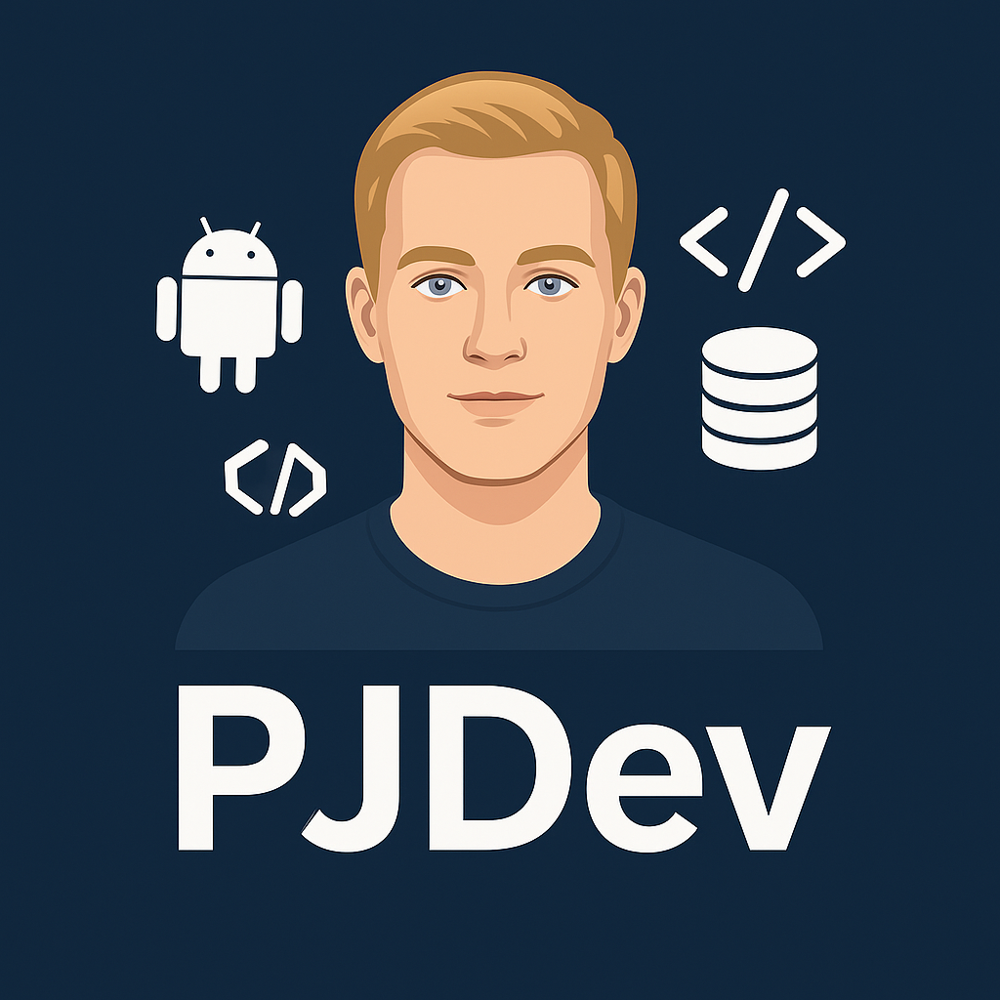
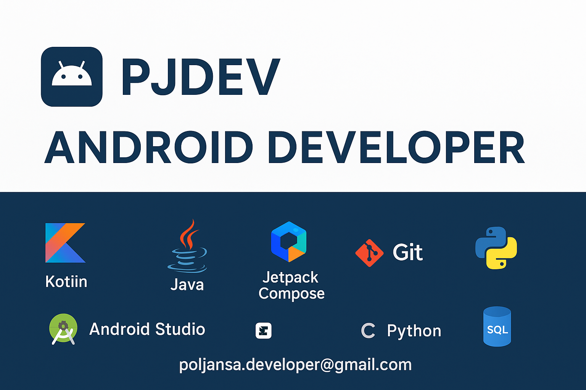

# 👋 Hola, soy Pol Jansa Sierra 

  

### 👨‍💻 Sobre mí  

Soy **Android Developer** especializado en **Java**, **Kotlin**, **Jetpack Compose**, **Firebase** y **arquitecturas limpias** (MVVM / Clean Architecture).  
Me apasiona construir aplicaciones móviles **escalables**, con una **experiencia de usuario cuidada** y un **código limpio y mantenible**.  

---

### 💼 Mi trayectoria  

Mi carrera comenzó en el ámbito **deportivo**, donde cursé un **Grado Medio y Superior en Actividades Físicas y Deportivas**, además de la **Licenciatura en Ciencias de la Actividad Física y del Deporte**.  
Durante más de **10 años** trabajé como **entrenador personal**, **profesor de esquí**, **gestor deportivo** y **jugador profesional de hockey**, experiencias que me enseñaron el valor del **trabajo en equipo**, la **disciplina** y la **mejora continua**.  

A los **28 años**, decidí dar un giro profesional para seguir otra de mis grandes pasiones: la **tecnología**. Completé un **Grado Superior en Desarrollo de Aplicaciones Multiplataforma (DAM)**, consolidando mi base técnica y adentrándome en el ecosistema **Android**, donde encontré mi auténtico camino.  

---

### 🌍 Experiencia y visión  

Durante los últimos años he tenido la oportunidad de **viajar por el mundo**, explorando diferentes culturas y sectores, lo que amplió mi **visión global** y me ayudó a **perfeccionar mi inglés**.  
Esta etapa me permitió absorber ideas, inspirarme en distintas formas de trabajar y fortalecer mi mentalidad abierta y creativa.  

Recientemente he completado un **Máster en Desarrollo Móvil para Android**, y actualmente busco **nuevos retos y proyectos** donde pueda **seguir creciendo profesionalmente**, **aportar valor a un equipo innovador** y **seguir aprendiendo cada día**.  

---

> 🎯 **Perfil multidisciplinar, con una base sólida en deporte, tecnología y liderazgo.**
> 💻 **Enfocado en la excelencia técnica y la mejora continua.**  
> 🚀 **Altamente motivado por crecer, aprender y construir soluciones que marquen la diferencia.**

---

## 📫 Contacto

📧 [poljansa.developer@gmail.com](mailto:poljansa.developer@gmail.com)  
🌐 [Portfolio](https://poljansadev.netlify.app)  
💼 [LinkedIn](https://www.linkedin.com/in/pol-jansà-sierra)

⭐ Abierto a colaboraciones y oportunidades como **Android Developer**

---

© 2025 PJDev — Striving for excellence in mobile development.

